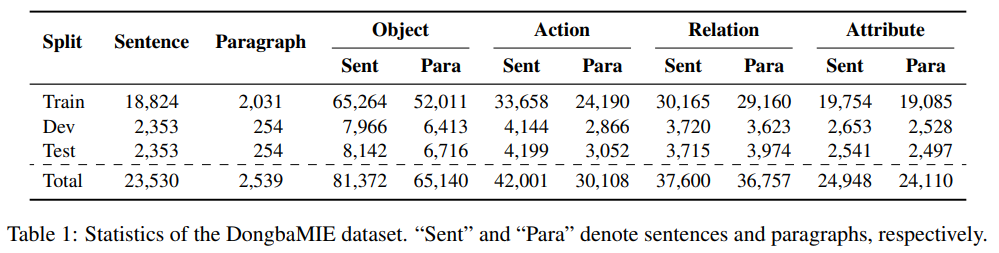
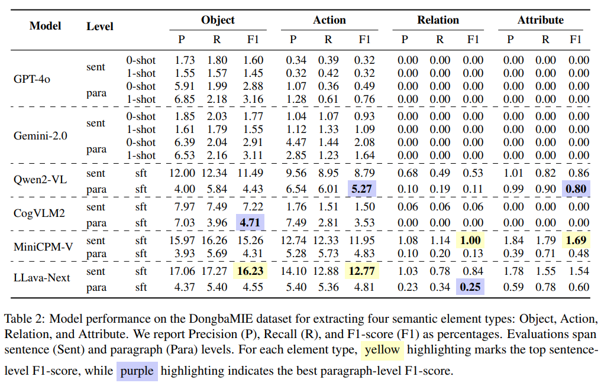
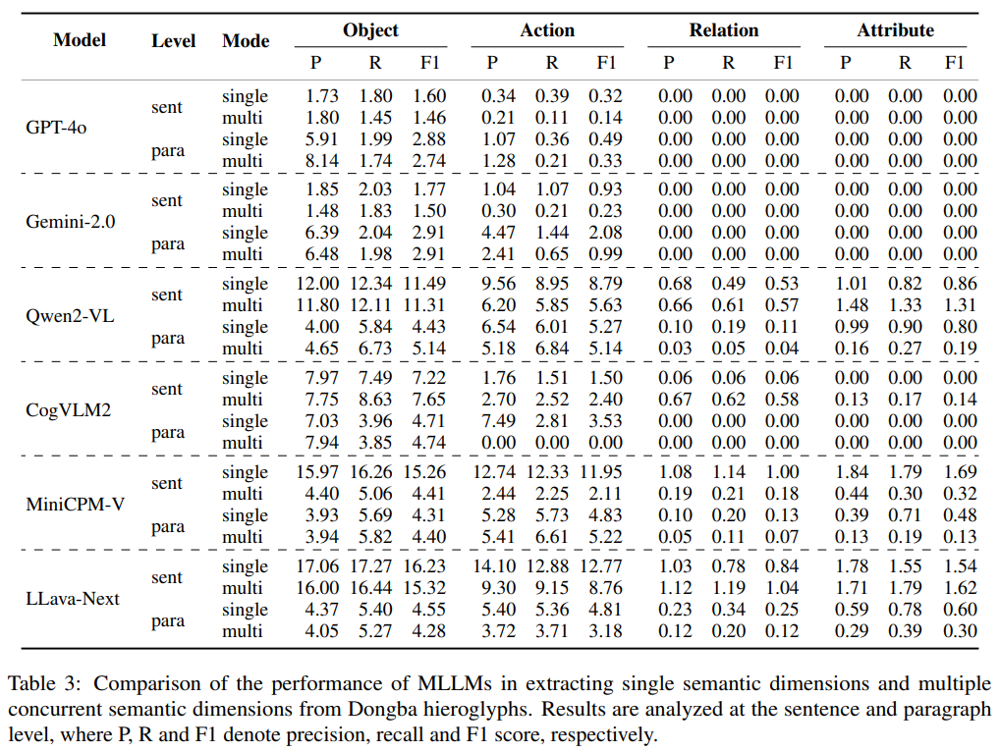

# DongbaMIE: A Multimodal Information Extraction Dataset for Evaluating Semantic Understanding of Dongba Pictograms

<p align="center"></p>

<div align="center">
    <a href="https://arxiv.org/abs/2503.03644">📖<strong>arXiv</strong></a> | <a href="https://huggingface.co/datasets/thinklis/DongbaMIE">🤗<strong>Dataset</strong></a>
</div>

  
## Timeline

📢 [2025-03-06] DongbaMIE dataset released.

📢 [2025-03-05] Paper and repo released.  

##  Constructing DongbaMIE Dataset

<p align="center"></p>


## Project Overview
This repository contains the following files:

- **[generate_data_qwen2vl.py](./generate_data_qwen2vl.py)** for building qwen2-vl format data
- **[gpt4o_vqa_test.py](./gpt4o_vqa_test.py)** for getting gpt4o and gemini test results
- **[metric.py](./metric.py)** for performance evaluation


##  Semantic visualization result

<p align="center"></p>


## DongbaMIE dataset statistics

<p align="center"></p>


## Result

#### Results of the three models on the DongbaMIE dataset
<p align="center"></p>

#### Results of three models extracting four semantic dimensions of objects, actions, relations, and attributes simultaneously in a single inference
<p align="center"></p>


## Citation
If you find our project useful, please consider citing:
```
@misc@misc{bi2025dongbamiemultimodalinformationextraction,
      title={DongbaMIE: A Multimodal Information Extraction Dataset for Evaluating Semantic Understanding of Dongba Pictograms}, 
      author={Xiaojun Bi and Shuo Li and Ziyue Wang and Fuwen Luo and Weizheng Qiao and Lu Han and Ziwei Sun and Peng Li and Yang Liu},
      year={2025},
      eprint={2503.03644},
      archivePrefix={arXiv},
      primaryClass={cs.CV},
      url={https://arxiv.org/abs/2503.03644}, 
}
```
